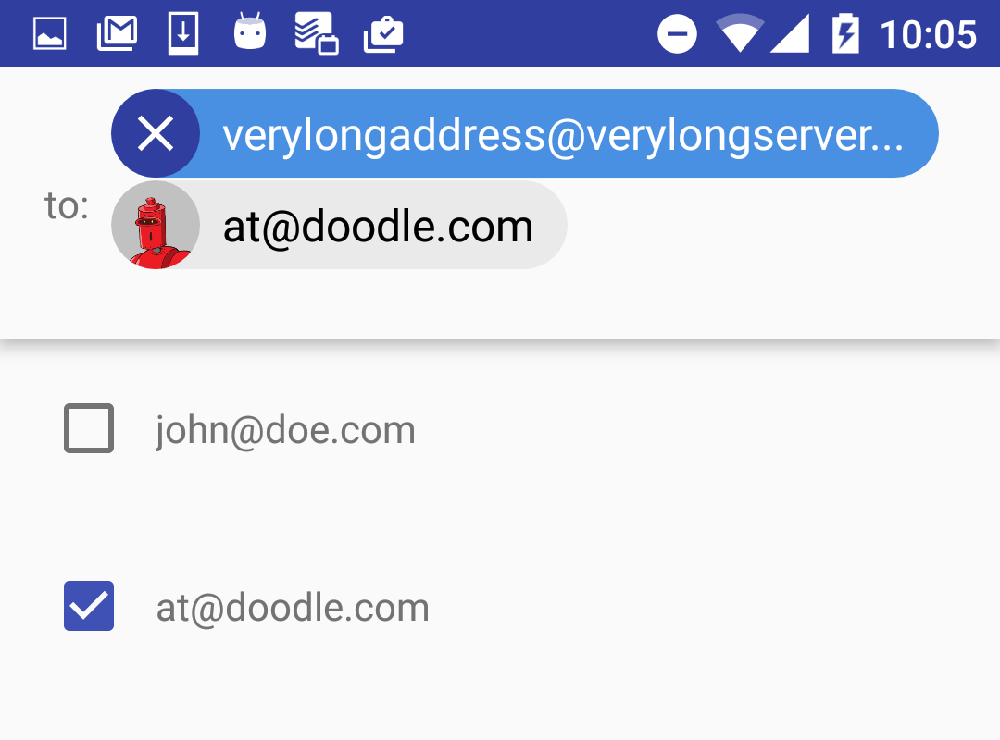
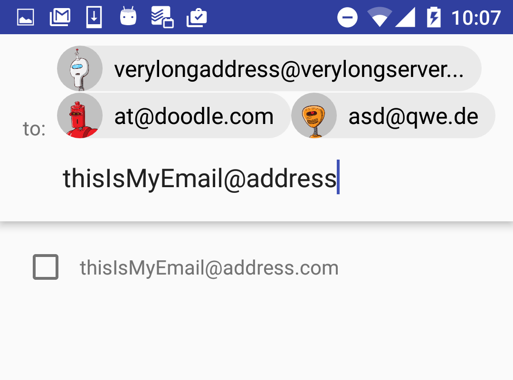
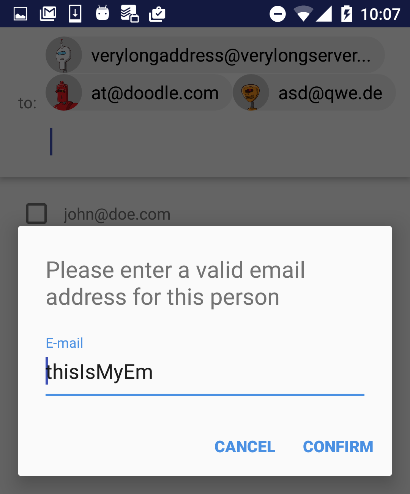
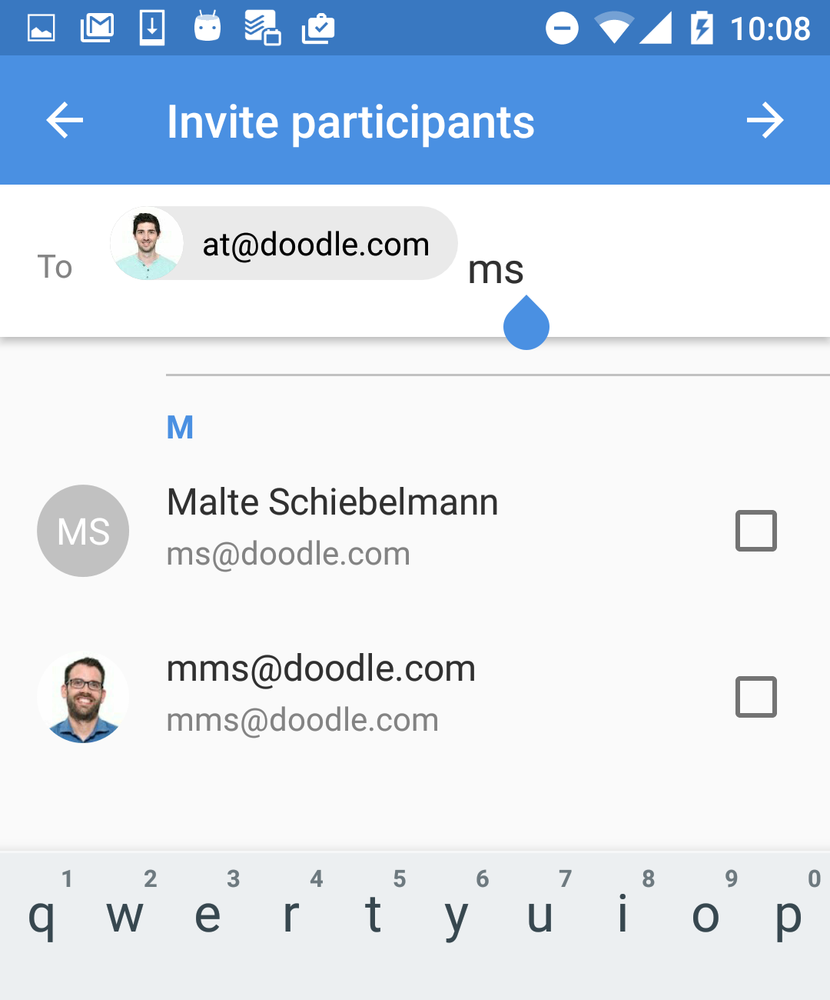
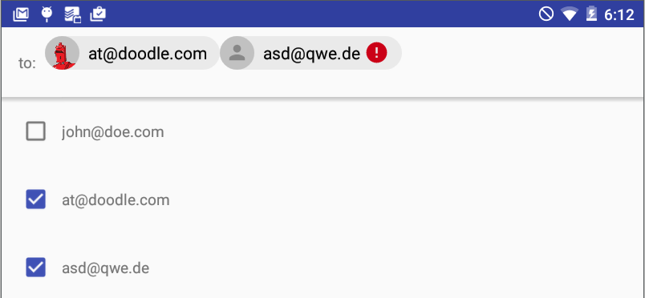

# Android Material Chips

A different approach to implement android material chips since using transformed images inside an EditText cause too many exceptions on older devices and older versions.

## Features
**Enter an email address and it will automatically transform into a chip**

<p>


</p>

**Email validation dialog**

<p>


</p>

**Customize your layout and text**

##Sample
**APK:** [sample-apk-1.0.1](https://github.com/DoodleScheduling/android-material-chips/releases/download/1.0.1/android-material-chips-1.0.1-sample.apk)
 
##Download

**Gradle:** 

```gradle
compile 'com.doodle.android:android-material-chips:1.0.1'
```


##Usage

Use the ChipsView class in your layout file.

```xml
<com.doodle.android.chips.ChipsView
    android:id="@+id/chipsView"
    android:layout_width="match_parent"
    android:layout_height="wrap_content" />
```

###Customize

**Layout**

Include ```xmlns:app="http://schemas.android.com/apk/res-auto"``` and customize your layout file.

```xml
<com.doodle.android.chips.ChipsView
    android:id="@+id/chipsView"
    android:layout_width="match_parent"
    android:layout_height="wrap_content"
    app:cv_bg_color="#f00"
    app:cv_bg_color_clicked="#0f0"
    app:cv_bg_color_error_clicked="#0f0"
    app:cv_color="#00f"
    app:cv_color_clicked="#721"
    app:cv_color_error_clicked="#f00"
    app:cv_text_color="#199"
    app:cv_text_color_clicked="#180"
    app:cv_text_color_error_clicked="#000"
    app:cv_icon_placeholder="@drawable/ic_bug_report_24dp"
    app:cv_icon_delete="@drawable/ic_close_24dp"
    app:cv_dialog_title="This is the title"
    app:cv_dialog_et_placeholder="email2"
    app:cv_dialog_confirm="confirm2"
    app:cv_dialog_cancel="cancel2"
```
======
Find the View in your Activity or Fragment class.

```java
mChipsView = (ChipsView) findViewById(R.id.chipsView);
```

**Listener**

The ChipsView provides a listener to interact with your data.

```java
mChipsView.setChipsListener(new ChipsView.ChipsListener() {
    @Override
    public void onChipAdded(ChipsView.Chip chip) {
        // chip added
    }

    @Override
    public void onChipDeleted(ChipsView.Chip chip) {
        // chip deleted
    }

    @Override
    public void onTextChanged(CharSequence text) {
        // text was changed
    }
});
```

**Add a new chip**

```java
mChipsView.addChip(email, imgUrl, contact);
```

**Add a non-removable chip.**

```java
mChipsView.addChip(email, imgUrl, contact, true);
```

**Remove a chip**

```java
mChipsView.removeChipBy(contact);
```

**Add Custom chip validator**

```java
mChipsView.setChipsValidator(new ChipsView.ChipValidator() {
    @Override
    public boolean isValid(Contact contact) {
        return true;
    }
});
```

<p>

</p>

## License

    Copyright (C) 2016 Doodle AG.
 
    Licensed under the Apache License, Version 2.0 (the "License");
    you may not use this file except in compliance with the License.
    You may obtain a copy of the License at
 
    http://www.apache.org/licenses/LICENSE-2.0
 
    Unless required by applicable law or agreed to in writing, software
    distributed under the License is distributed on an "AS IS" BASIS,
    WITHOUT WARRANTIES OR CONDITIONS OF ANY KIND, either express or implied.
    See the License for the specific language governing permissions and
    limitations under the License.
    